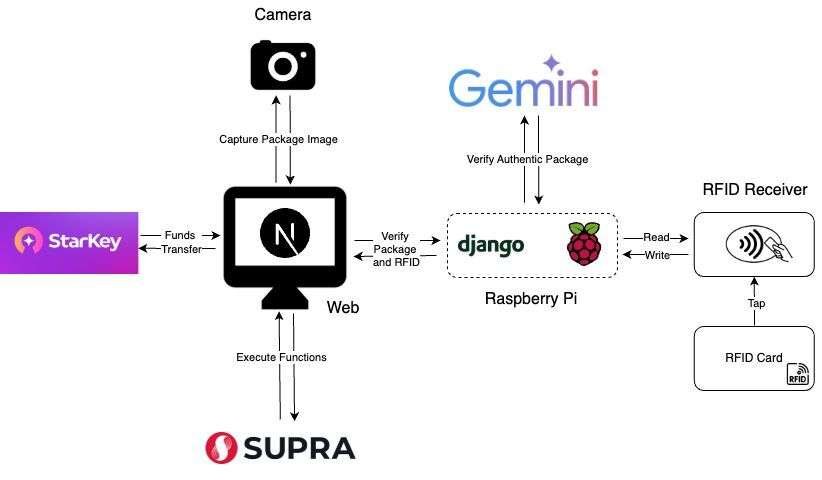

# **SupraTag**

**SupraTag** is a cutting-edge solution that integrates IoT, RFID technology, and blockchain-powered smart contracts to create a secure, decentralized package authentication system. Built for the **Supra Movers Hackathon**, SupraTag aims to revolutionize supply chain security and package verification.

---

## **Team Higgs**

We are **Team Higgs**, a group of students from **NITK, Surathkal**. Our team members include:

- **Fahim Ahmed** [LinkedIn](https://www.linkedin.com/in/fahim-ahmed-35142a256/)
- **Apoorva Agrawal** [LinkedIn](https://www.linkedin.com/in/apoorva-agrawal-8302b825a/)
- **Vedant Tarale** [LinkedIn](https://www.linkedin.com/in/vedant-tarale-802528173/)
- **Abhishek Satpathy** [LinkedIn](https://www.linkedin.com/in/abhishek-satpathy/)

---

## **Video Explainer**

[Watch the Video Explainer](#)

---

## **Overview**

**SupraTag** uses RFID technology and blockchain to ensure package authenticity and traceability. By integrating IoT devices such as Raspberry Pi, RFID cards/readers, and a **Supra blockchain smart contract written purely in Move language**, **SupraTag** provides an innovative approach to secure package management. The project includes a seamless web interface for both the customer and the vendor/delivery agent to perform seamless interactions.

---

## **Our Vision**

We envision a future where package authentication is **secure, decentralized, and tamper-proof**. By leveraging blockchain, IoT, and RFID technology, SupraTag eliminates the risk of counterfeit goods and ensures complete traceability of shipments.

---

## **System Architecture**



---

## **Our Approach**

SupraTag takes a **multi-layered security approach** by combining:

1. **RFID technology** for package tagging and scanning.
2. **IoT integration** via Raspberry Pi to process package data.
3. **Blockchain (Supra, Move-based smart contract)** for immutable storage and smart contract execution.
4. **Web-based platform (Next.js)** for user interaction and verification.
5. **External Verification (Galadriel)** to cross-check package authenticity.

With this setup, SupraTag guarantees a **seamless and fraud-resistant** package authentication system.

---

## **Features**

- **RFID-Based Secure Authentication:** Prevents package tampering.
- **Decentralized Blockchain Storage:** Ensures immutability of records.
- **IoT-Powered Verification:** Real-time package tracking.
- **Web-Based Access:** Secure and easy-to-use verification interface.
- **Smart Contract Automation:** Transparent and trustless validation.
- **Move-Based Smart Contract:** Ensures efficiency, security, and tamper-proof execution.

---

## **Technology Stack**

| **Component**   | **Technology**     |
| --------------- | ------------------ |
| **Web3 Wallet** | Starkey Wallet     |
| **IoT**         | RFID, Raspberry Pi |
| **Backend**     | Django             |
| **Web App**     | Next.js            |
| **Blockchain**  | Supra              |

---

## **Implementation**

### **1. Prerequisites and Clone the Repository**

- **Hardware:** Raspberry Pi with an RFID receiver.
- **Software:**
  - Python, Node.js, npm
  - Supra account setup

```bash
git clone https://github.com/imApoorva36/Higgs-Supra-Hackathon.git
cd Higgs-Supra-Hackathon
```

### **2. Backend Setup (Django)**

```bash
cd backend
pip install -r requirements.txt
python manage.py runserver
```

### **3. Web App Setup (Next.js)**

```bash
cd web
npm install
npm run dev
```

---

## **Challenges Faced – SupraTag**

Developing **SupraTag** involved several technical hurdles across **smart contract development, Supra SDK integration, and RFID-web app synchronization**. Each challenge required debugging, iterative refinement, and structured problem-solving.

**Smart contract compilation** in Move was a significant challenge due to its strict type system and ownership constraints. Errors in type mismatches and resource management required multiple iterations. Limited documentation made troubleshooting difficult, so we modularized our code and referred to existing examples for best practices.

**Integrating the Supra SDK** was another hurdle, particularly with **package imports (`supra-l1-sdk`) and API type mismatches** when calling smart contract functions. Additionally, handling asynchronous function calls correctly was essential. We resolved this by debugging dependencies, restructuring API calls, and implementing better error-handling mechanisms.

**RFID integration with the web app** posed synchronization issues. The RFID scanner had to communicate with the backend in real-time, triggering blockchain verification. We faced **latency in fetching scan data and ensuring accurate package mapping**. To address this, we implemented **WebSockets** for real-time updates and optimized API interactions.

Finally, **learning Move** was challenging due to its strict security model and limited resources. Understanding ownership rules and structuring contracts efficiently required significant effort. We overcame this by analyzing existing contracts, leveraging documentation, and breaking down the contract into smaller testable components.

Despite these challenges, overcoming them resulted in a **robust, scalable, and secure** package authentication system.

---

## **Problem Statement & Solution – SupraTag**

### **The Problem: Lack of Secure and Trustworthy Package Authentication**

In today’s global supply chain, **counterfeit goods, package tampering, and lack of verifiable authenticity** pose significant risks to businesses and consumers. Traditional logistics systems rely on **centralized databases** and **manual verification**, making them vulnerable to fraud, unauthorized modifications, and inefficiencies.

**Key Challenges:**

- **Counterfeit Products** – Fake goods infiltrating supply chains, leading to financial and reputational damage.
- **Package Tampering** – No secure mechanism to detect unauthorized access or modifications.
- **Lack of Transparency** – Customers and businesses struggle to verify the authenticity of received shipments.
- **Centralized Trust Issues** – Traditional logistics rely on intermediaries, making data prone to manipulation.
- **Delayed Verification** – Current tracking systems lack real-time authentication, causing inefficiencies.

### **Our Solution: SupraTag – Secure, Decentralized Package Authentication**

**SupraTag** leverages **RFID technology, IoT integration, and blockchain-powered smart contracts (Move on Supra Blockchain)** to create a **trustless, tamper-proof, and fully traceable package verification system**.

**How SupraTag Solves the Problem:**

1. **RFID-Based Authentication** – Each package is assigned a unique RFID tag linked to a blockchain record, ensuring authenticity.
2. **IoT-Driven Verification** – A Raspberry Pi-based RFID scanner records package data and updates the blockchain in real time.
3. **Immutable Blockchain Storage** – All package interactions are recorded on **Supra’s decentralized ledger**, preventing data tampering.
4. **Smart Contract Automation** – Move-based smart contracts **enforce trustless validation**, ensuring that only legitimate transactions occur.
5. **Web-Based Verification** – Customers and logistics partners can scan RFID tags to instantly verify a package’s authenticity via a user-friendly Next.js platform.
6. **External Verification with Galadriel** – Further enhances security by cross-checking package records with external data sources.

### **Why SupraTag is a Game-Changer**

- **Eliminates Counterfeits** – Guarantees package legitimacy with blockchain-backed proof.
- **Tamper-Proof Security** – Unauthorized access is instantly detected and recorded.
- **Trustless & Decentralized** – No need for intermediaries; verification is transparent and immutable.
- **Real-Time Verification** – Packages can be authenticated within seconds using RFID and web-based access.
- **Seamless Integration** – Works with existing supply chain infrastructure, enhancing security without adding friction.

By integrating **Supra blockchain, IoT, and RFID technology**, **SupraTag** provides a next-generation solution for **secure, transparent, and fraud-resistant package authentication**, making supply chains more reliable and efficient.

---

## **Migration from Box3 to SupraTag**

Our previous project, **Box3**, was built on Ethereum and included additional technical components that were not essential. With **SupraTag**, we have migrated to the **Supra blockchain** and rewritten our smart contracts in the **Move language**, which offers several advantages such as improved security and efficiency. We also streamlined the project by removing unnecessary components like a separate app and focusing on a web-based interface. Additionally, we integrated the **Starkey Wallet** for better user experience. This migration has resulted in a more robust, scalable, and user-friendly package authentication system.

---

## **Contributing**

Contributions are welcome! Follow these steps to contribute:

1. Fork the repository:
   ```bash
   git fork https://github.com/imApoorva36/Higgs-Supra-Hackathon.git
   ```
2. Create a feature branch:
   ```bash
   git checkout -b feature-name
   ```
3. Commit your changes:
   ```bash
   git commit -m "Add your message here"
   ```
4. Push to your branch:
   ```bash
   git push origin feature-name
   ```
5. Open a pull request.

---

## **License**

This project is licensed under the [MIT License](LICENSE).
